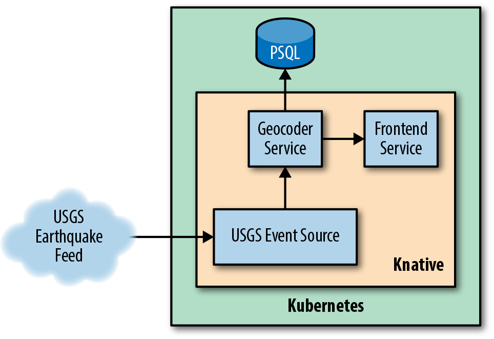
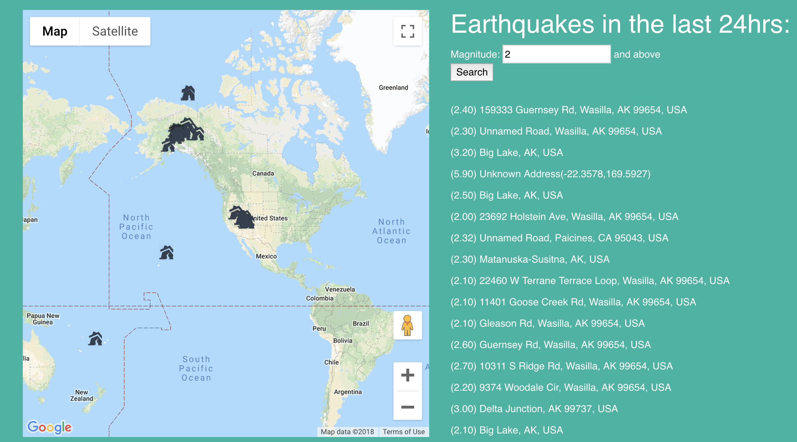

This work is a fork version of the work [earthquake-demo](https://github.com/gswk/earthquake-demo).
The initial version is deploy in Knative 0.6, we update the deployment to Knative 0.10
Furthermore, we change some source code to deploy in China.


- [**USGS Event Source**](https://github.com/yuxiaoba/Serverless-Bechmark/tree/master/earthquake-demo/usgs-event-source) - A custom event source that polls the USGS Earthquake data on a given interval
- [**Geocoder Service**](https://github.com/yuxiaoba/Serverless-Bechmark/tree/master/earthquake-demo/geocoder) - Service that takes in earthquake activity, parses it and does a reverse geocode on the coordinates to find the nearest address. Also provides recent activity to the frontend.
- [**Geoquake Frontend**](https://github.com/yuxiaoba/Serverless-Bechmark/tree/master/earthquake-demo/earthquake-demo-frontend-node) - Frontend to visualize and list activity


Setup Postgres
---

Our application will rely on a Postgres database to store events as they come in.
```
$ kubectl apply -f postgresdb/postgres-config.yaml
$ kubectl apply -f postgresdb/postgres-storage.yaml
$ kubectl apply -f postgresdb/postgres-deployment.yaml
$ kubectl apply -f postgresdb/postgres-service.yaml
$ kubectl get pod
NAME                        READY   STATUS    RESTARTS   AGE
postgres-54967df8fd-6526k   1/1     Running   0          1m

$ kubectl get svc
NAME                              TYPE           CLUSTER-IP      EXTERNAL-IP            PORT(S)             AGE
postgres                          ClusterIP      10.68.199.222   <none>                 5432/TCP            6h4m
```

Once it's up and running this database will be available internally to our Kubernetes cluster at `postgre.default.svc.cluster.local`. 

```
$ kubectl exec -it postgres-54967df8fd-6526k   sh
# psql -h postgres -p 5432 -U postgres
Password for user postgres: 
psql (10.4 (Debian 10.4-2.pgdg90+1))
Type "help" for help.

postgres=# \list
List of databases
   Name    |  Owner   | Encoding |  Collate   |   Ctype    |   Access privileges   
-----------+----------+----------+------------+------------+-----------------------
 geocode   | postgres | UTF8     | en_US.utf8 | en_US.utf8 | 
 postgres  | postgres | UTF8     | en_US.utf8 | en_US.utf8 | 
 template0 | postgres | UTF8     | en_US.utf8 | en_US.utf8 | =c/postgres          +
           |          |          |            |            | postgres=CTc/postgres
 template1 | postgres | UTF8     | en_US.utf8 | en_US.utf8 | =c/postgres          +
           |          |          |            |            | postgres=CTc/postgres
(4 rows)

```

Deploy Geocode Service
---
```
kubectl apply -f geocoder.yaml
```

Deploy the Frontend
---

Note the `env` section of this file, which has an `EVENTS_API` environment variable. 
This is how our frontend knows about our geocoder service.
Do not forget to change this environment variable.
```
kubectl apply -f frontend-service.yaml
```

Deploy the USGS Event Source
---

Before we set up our Event Source, we’ll also need a Channel to send events to. 
```
kubectl apply -f channel.yaml
```

Then we write a custom Event Source using the ContainerSource
```
kubectl apply -f usgs-event-source.yaml
```

Additionally, we’ll need to hook our Geocoder Service up to the Channel.
```
kubectl apply -f subscription.yaml
```

Accessing Our Application
---

Finally, with everything deployed, we can access our running application. 
```
$ kubectl get ksvc
NAME                URL                                                         LATESTCREATED             LATESTREADY               READY   REASON
earthquake          http://earthquake.default.serverless.dds-sysu.tech          earthquake-zktff          earthquake-zktff          True    
geocoder            http://geocoder.default.serverless.dds-sysu.tech            geocoder-crd59            geocoder-crd59            True

$ curl http://earthquake.default.serverless.dds-sysu.tech
```

The UI of our running application 

